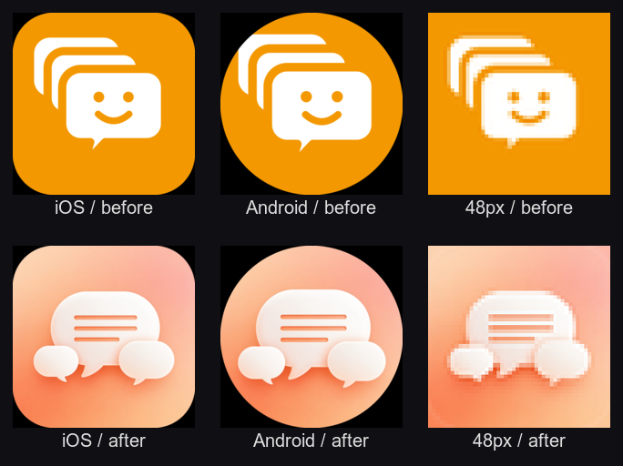

# ストアスクリーンショット刷新（2026-08 / scenario.com 用プロンプト付き）

## なぜ作り直すか

現行のスクリーンショットは **2021年のFlutter版**のまま。実測した証拠:

- 記事の日付が `2021-06-22`（東京五輪の話題）
- タブバーが英語（`Ranking / Search / My Page / Setting`）。現行は `79aa8e7` で日本語化済み
- タブが `NEW / for You`。現行は `NEW / あなたへ`
- **3枚目に、AdMobから違反と指摘された当のUI（画面下部の「記事を開く」ボタン＋直下の広告）が写っている**。1.44で撤去した画面
- **同じ3枚目にテスト広告（Test mode）が写り込んでいる**

とくに下2つは、9/14以降のAdMob審査リクエストでレビュアーの目に触れる可能性がある。
「修正済み」と主張しながら違反時の画面をストアに掲示している状態は避けたい。

## 訴求の方針

**「広告カット」「広告なし」は使わない。** AdMobで収益化していることと矛盾し、
他パブリッシャーの広告を除去していると自ら宣言する形になる
（2026-08-14の違反の引き金。docs/GROWTH-PLAN.md の⚠️を参照）。

打ち出すのは **競合に存在せず、かつ自社が生成した情報**である3点:

1. **読み上げ**（ハイライト追従つき） — 1.49〜1.51で実装。競合になし
2. **話題検知**（複数サイトが同じスレをまとめたら検知） — 1.49で実装。競合になし
3. **69サイト横断**（ランキング・検索） — 単一サイトでは作れない指標

整形の読み口に触れる場合も「本文だけを読みやすく」まで。除去の対象は列挙しない。

## 構成（6枚）

検索結果に出るのは最初の1〜3枚。**1枚目に最大の差別化＝読み上げを置く。**
文字は3〜7語、画面の上1/3に大きく。実画面は下2/3に配置する。

| # | キャッチ（案） | サブ | 必要な実画面 | 狙い |
|---|---|---|---|---|
| 1 | **読まずに、聴く。** | 通勤中も、作業中も、耳だけで | 記事画面＋読み上げバー＋ハイライト行 | 競合にない機能を最初に見せる。「ながら聴き」は利用時間を伸ばす=DAUに直結 |
| 2 | **盛り上がってるスレが、わかる。** | 複数サイトが同じ話題を扱うと自動で検知 | 祭り画面 or 新着の🔥バッジ付きカード | 「見逃したくない」動機。再訪の理由になる |
| 3 | **69サイトを、ひとつに。** | なんJもVIPもニュースも、まとめて | サイト選択画面（チェックの並び） | 網羅性。競合の「サイト数が少ない」不満への回答 |
| 4 | **本文だけ、すぐ読める。** | サイドバーも目次もない画面で | 記事画面（整形後の本文＋出典） | 読み口の良さ。※広告に触れない表現 |
| 5 | **今日いちばん読まれたスレ。** | 日間・週間・月間のランキング | ランキング画面 | 「何を読むか決まっていない」層の入口 |
| 6 | **読むほど、好みに寄る。** | あなた向けのおすすめと関連記事 | Home「あなたへ」タブ | 継続利用の訴求 |

Play は8枚まで、App Store は10枚まで。まず6枚で出し、反応を見て増やす。

## デザイン方針（2026年のストア面で浮くもの）

- **ダークベース＋オレンジの発光**。アプリ本体がダークテーマ（`#303030` / `#212121`）なので、
  背景も暗くすると実画面が浮き上がり、境目が自然になる。旧スクショの淡い黄色背景は
  実画面（ダーク）と分離してしまい古く見える
- **端末フレームは薄く**。太いベゼルのiPhoneフレームは古い。角丸と細い縁だけにする
- **キャッチは1行、最大でも2行**。読点で切って余白を残す
- **1枚目だけ縦にパース無し**（正面）。2枚目以降は軽い傾きを入れて連続性を出す

### ブランド実値

| 用途 | 値 |
|---|---|
| ブランドオレンジ | `#F39800`（アイコンから抽出） |
| 背景（アプリ本体） | `#303030` / AppBar `#212121` |
| アクセント（稲妻・祭り） | `#FFC107` |
| タブバー | `#607D8B` |
| サイト名 | `#EF9A9A` |

---

## scenario.com へのプロンプト

**重要: 日本語のキャッチコピーをAIに描かせない。** 生成モデルは日本語の字形を崩す。
scenario.com で作るのは**背景と装飾のみ**で、テキストと実画面は後から重ねる。

全プロンプト共通で末尾に付けるもの:

```
9:16 vertical composition, generous empty space in the upper third for text overlay,
premium mobile app store marketing aesthetic, subtle film grain, no text, no letters, no logo
```

共通のネガティブプロンプト:

```
text, letters, words, japanese characters, typography, watermark, logo, ui mockup, phone frame,
people, faces, hands, cluttered, busy composition, low contrast, muddy colors, jpeg artifacts
```

### 1枚目（読み上げ）— 最重要

```
Dark premium background for a mobile app store screenshot, deep charcoal gradient from #17181C at top
to #232428 at bottom, warm amber-orange #F39800 light blooming from the lower center like a speaker glow,
concentric audio waveform rings expanding softly outward and fading, thin luminous arcs,
floating dust particles catching the orange light, cinematic rim light, calm and focused mood,
9:16 vertical composition, generous empty space in the upper third for text overlay,
premium mobile app store marketing aesthetic, subtle film grain, no text, no letters, no logo
```

### 2枚目（話題検知・祭り）

```
Dark premium background for a mobile app store screenshot, near-black #15161A base,
multiple glowing nodes connected by thin light threads converging into one bright hotspot,
ember-orange #F39800 and amber #FFC107 accents, sparks rising from the convergence point,
sense of many sources igniting the same topic, subtle radial heat haze, deep shadows,
9:16 vertical composition, generous empty space in the upper third for text overlay,
premium mobile app store marketing aesthetic, subtle film grain, no text, no letters, no logo
```

### 3枚目（69サイト横断）

```
Dark premium background for a mobile app store screenshot, charcoal #1A1B1F base,
an orderly grid of many small softly glowing tiles receding into depth, gentle perspective,
a few tiles highlighted in warm orange #F39800 while others rest in cool grey,
sense of abundance organized into one place, soft vignette, clean and architectural,
9:16 vertical composition, generous empty space in the upper third for text overlay,
premium mobile app store marketing aesthetic, subtle film grain, no text, no letters, no logo
```

### 4枚目（読み口）

```
Dark premium background for a mobile app store screenshot, smooth deep grey #1C1D21 gradient,
minimal composition, a single clean vertical column of soft light suggesting a decluttered reading surface,
faint horizontal lines fading at the edges like settled text, warm orange #F39800 used sparingly
as a thin accent line, calm, spacious, restrained,
9:16 vertical composition, generous empty space in the upper third for text overlay,
premium mobile app store marketing aesthetic, subtle film grain, no text, no letters, no logo
```

### 5枚目（ランキング）

```
Dark premium background for a mobile app store screenshot, deep charcoal #18191D base,
three ascending podium-like light columns of increasing height, the tallest crowned with
warm orange #F39800 glow, soft upward light streaks, subtle confetti-like particles,
sense of daily ranking and momentum, cinematic depth,
9:16 vertical composition, generous empty space in the upper third for text overlay,
premium mobile app store marketing aesthetic, subtle film grain, no text, no letters, no logo
```

### 6枚目（パーソナライズ）

```
Dark premium background for a mobile app store screenshot, charcoal #1A1B20 base,
soft orbiting rings of light gradually tightening toward a warm orange #F39800 core,
suggesting personalization converging on a single taste, gentle gradient bloom,
delicate particle trails, intimate and warm,
9:16 vertical composition, generous empty space in the upper third for text overlay,
premium mobile app store marketing aesthetic, subtle film grain, no text, no letters, no logo
```

### 予備: アイコンを活かした装飾素材（任意）

キャラクター（オレンジ地に白い笑顔＋吹き出し）をあしらう場合。
**アイコンそのものを再生成させない**（崩れる）。あくまで背景の飾り。

```
Abstract speech bubble shapes floating in a dark space, rounded soft silhouettes,
warm orange #F39800 and white, varying sizes and depths, soft blur on distant ones,
playful but premium, minimal, lots of negative space,
9:16 vertical composition, no text, no letters, no faces, no logo
```

---

## 制作手順（8/22 にクレジット復活後）

1. **実画面を撮る**（このリポジトリの担当。iOSシミュレータ iPhone 17 Pro）
   - 上表「必要な実画面」の6枚。読み上げ中・ハイライト表示中の状態を含む
   - **本番広告ユニットを踏まないこと**。debug ビルドか `EXPO_PUBLIC_ADS_ENV` 未設定で撮る
     （1.51以降は production ビルド以外なら自動でテスト広告）
   - テスト広告が写る場合は、広告の出ない画面を選ぶか、撮影後に該当領域を実画面の別部分で覆う
2. **scenario.com で背景6枚を生成**（上記プロンプト。9:16）
3. **合成**: 背景 → 実画面（角丸・薄い縁）→ キャッチ（後乗せ）
4. **書き出しサイズ**
   - App Store 6.5インチ: **1284 × 2778**（必須）
   - Play: **1080 × 1920** 以上、最大8枚
5. **アップロード前の確認**
   - 画面内に広告枠が写っていないか
   - 画面下部にタップ要素が写っていないか（AdMob違反時のUIと誤解されないため）
   - 表示中の記事タイトルが不適切でないか（年齢区分の申告と整合するか）

## 効果測定

差し替え後、Play Console の「ストアのパフォーマンス」でストア掲載ページの
**表示回数→インストール率**を差し替え前後で比較する。
GROWTH-PLAN の目標は新規インストール 8件/月 → 300件/月。

---

# アプリアイコン（2026-08-21 差し替え）

支給されたデザイン（オレンジのグラデーション地に白い吹き出し3つ、大きい吹き出しの中に
書き込みを表す3本の線）を、アプリアイコンとして使える形に整えて差し替えた。



## 支給データに手を入れた点

### 1. 焼き込まれていた角丸と白余白を落とし、全面塗りに直した

支給された 2048px の画像は**角丸が焼き込まれ、外側が白**だった（丸みの半径は実測で約380px）。
このまま入れると iOS/Android がさらにマスクを掛けるので、**二重に丸まって角に白が残る**。

角丸の外側を背景グラデーションで埋めて全面塗りにした。手順:

1. 半径520pxの角丸矩形マスクを作り、外側を「埋める領域」とする
   （実測380pxより大きく取って、元の輪郭のにじみを巻き込まないようにする）
2. 64pxまで落とした画像で「ぼかす → 有効領域だけ元に戻す」を220回繰り返し、
   周囲の色を角へ拡散させる。2048pxのままでは1回あたりの変化量が量子化で消えて拡散が進まない
3. 拡散結果を2048pxへ戻し、境界を50pxぼかしたマスクで元画像と合成する。
   継ぎ目を完全に消すにはこのぼかしが要る

### 2. Android のアダプティブ前景を作り直した

アダプティブアイコンは108dpのうち**中央72dp（66.7%）しか表示されない**。
デザインを70%に縮めて中央に置き、外周は端の画素を伸ばして埋めた（外周は通常見えないが、
ランチャーの視差で覗いたときに違和感が出ないようにするため）。

> ⚠️ `-set option:distort:viewport` に負のオフセットを渡す書き方は効かず、中身が左上へずれた。
> `-distort SRT` で「元画像の中心を出力の中心へ」写す形に変えている。
> **生成後は必ず中心座標を測って確認すること**（ずれるとランチャーで片側だけ切れる）。

### 3. 通知アイコンを彩度で抜き出した

Android のステータスバー通知アイコンは alpha しか見ないため、白いシルエットである必要がある。
このデザインは**白い吹き出し（彩度3%前後）とオレンジの背景（彩度28%以上）**で
はっきり分かれているので、彩度13%で二値化するだけで抜ける。
吹き出しの中の3本の線はオレンジ＝彩度が高いので、**自動的に穴になる**のが都合がよい。

## 生成

```bash
./scripts/build-icons.sh   # 要: brew install imagemagick
```

| ファイル | 役割 |
|---|---|
| `assets/app/design/icon-master.png` | 原本（2048px・角丸なし・余白なしの全面塗り） |
| `scripts/build-icons.sh` | 上記から全 PNG / WebP を生成 |

`android/` と `ios/` は `.gitignore` 済みの prebuild 生成物（Expo CNG）なので、
正本は `assets/app/*.png`。ビルドのたびにそこから作り直される。

## 実寸で確認した結果

| サイズ / マスク | 結果 |
|---|---|
| iOS 角丸マスク | 全面塗りで、角に白が残らない |
| Android 円マスク | 中央に収まり、どこも切れない |
| Android 角丸マスク | 同上 |
| 96px | 吹き出し3つと3本の線がはっきり読める |
| 48px | 吹き出し3つのシルエットは残る。**3本の線は溶けて1つの塊に見える** |
| 通知アイコン 24px | 吹き出しと線のシルエットとして読める |

正直に書いておくと、**48pxでの明瞭さは差し替え前より落ちている**。
前のアイコンは単色オレンジに白だったので境界が硬かったが、今回は背景がグラデーションで、
上側が淡いピーク（`#FCC3A8` 前後）のため白との明度差が小さい。
下側はオレンジが濃いので沈まない。実害が出るとすれば検索結果の一覧なので、
差し替え後に Play Console の「表示回数→インストール率」を見て判断する。

## 色

グラデーションから採った値。従来のブランドオレンジ `#F39800`（黄寄り）ではなく、
今回のデザインはコーラル寄りなので合わせ直した。

| 用途 | 値 | 出どころ |
|---|---|---|
| `adaptiveIcon.backgroundColor` | `#FBA675` | デザイン下端の平均。前景が不透明なので実際には見えない保険 |
| `notification_icon_color` | `#FA8659` | デザイン左下。ステータスバーの着色に使われる |

## 残っている確認

- [ ] 実機／エミュレータでホーム画面のアイコンを目視（iOS シミュレータと Android エミュレータの両方）
- [ ] 通知を1件出してステータスバーのアイコンを目視
- [ ] スプラッシュ画面の見え方
- [ ] ストア掲載アイコンの差し替え（Play Console / App Store Connect）。次のバージョン提出時に併せて行う
